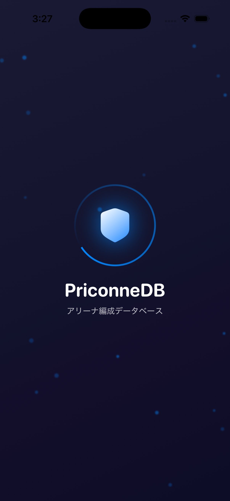
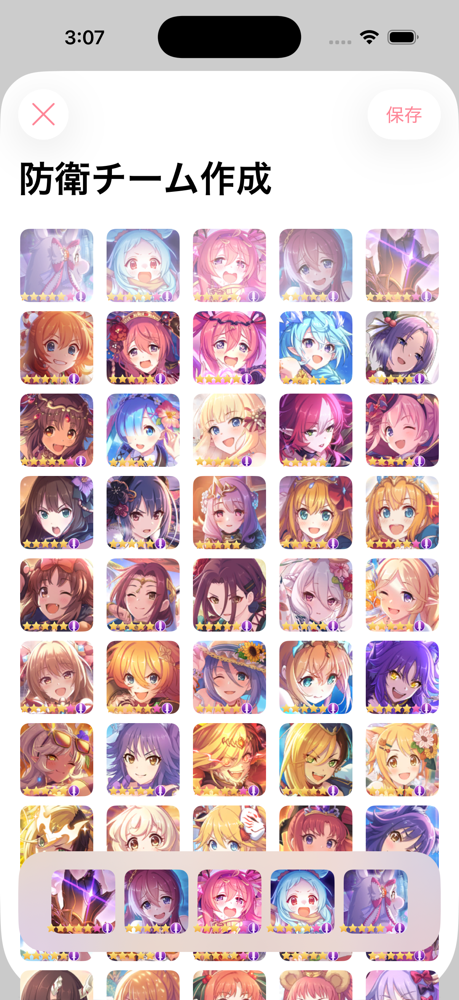
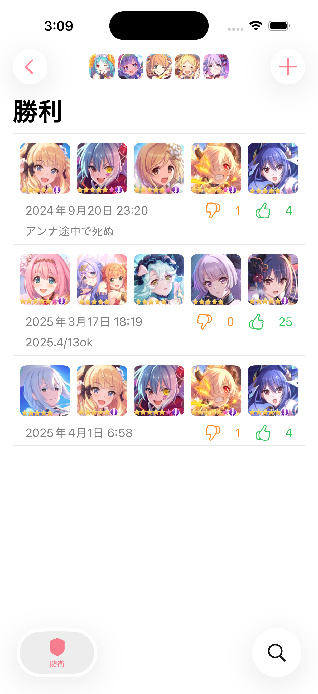
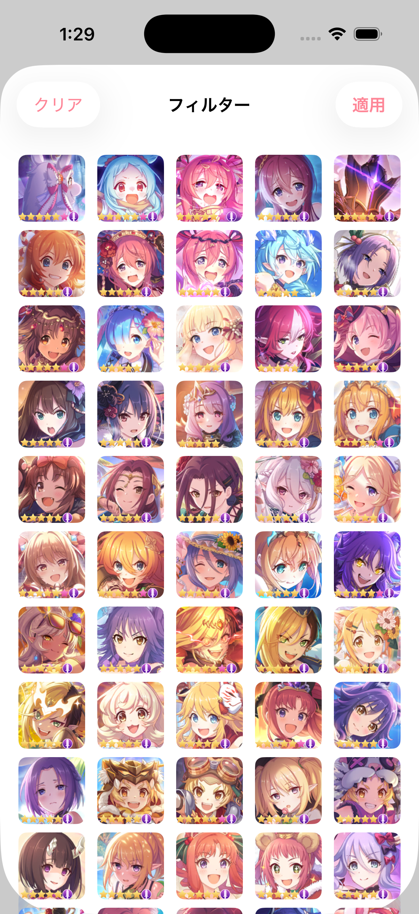
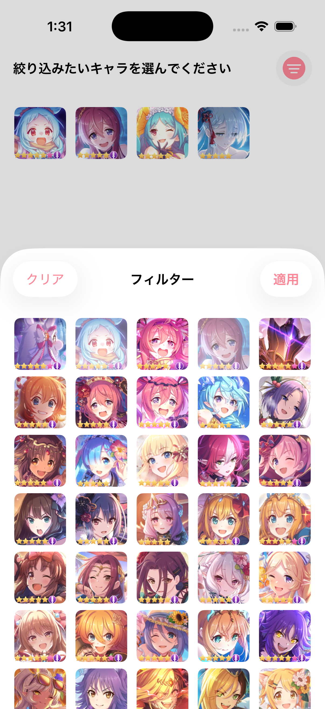
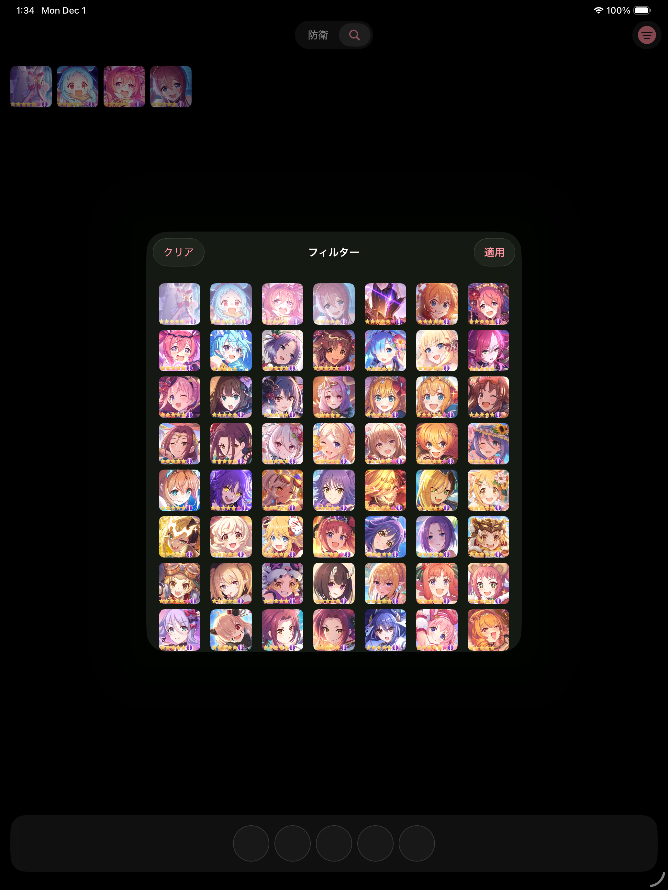

# PriconneDB

趣味で開発したiOS/iPadOSアプリです。SwiftUIとFirebaseを使ったモダンなiOSアプリ開発の学習・実験プロジェクトとして作成しました。

> **注意**: このアプリはゲームとは一切関係ありません。個人の技術学習目的で開発されたものです。

## スクリーンショット

### iPhone

<p align="center">
  
  
  
  
</p>

<p align="center">
  
  
  
  
</p>

### iPad

<p align="center">
  
  
</p>

<p align="center">
  
  
</p>

<p align="center">
  
  
</p>

## デモ動画


## 技術スタック

| カテゴリ | 技術 |
|---------|------|
| 言語 | Swift 6.2 |
| UI | SwiftUI (iOS 26+, Liquid Glass対応) |
| アーキテクチャ | MVVM + Inputs/Outputs パターン |
| データベース | Firebase Firestore |
| 画像読み込み | Kingfisher + WebP対応 |
| パッケージ管理 | Swift Package Manager |
| CI/CD | Bitrise + fastlane |
| コード品質 | SwiftLint, SwiftFormat, Sourcery |

## アーキテクチャ

### モジュール構成

マルチモジュール構成でFeatureごとにパッケージを分割しています。

```
Packages/
├── AppFeature/              # メインTabView、アプリのエントリーポイント
├── AttackTeamListFeature/   # 攻撃チーム一覧機能
├── CreateAttackTeamFeature/ # 攻撃チーム作成機能
├── CreateDefenseTeamFeature/# 防衛チーム作成機能
├── DefenseTeamListFeature/  # 防衛チーム一覧機能
├── FilterUnitsFeature/      # ユニットフィルター機能
├── SearchViewFeature/       # ユニット検索機能
├── Entity/                  # データモデル
├── Networking/              # Firestore クライアント
├── Storage/                 # UserDefaults永続化
├── SharedViews/             # 共通UIコンポーネント
├── Resources/               # 画像アセット
├── Mocks/                   # テスト用モック（Sourcery生成）
└── MockSupport/             # モックサポートユーティリティ
```

### MVVM + Inputs/Outputs パターン

ViewModelは`Inputs`と`Outputs`プロトコルで明確にインターフェースを分離しています。

```swift
@MainActor
protocol ViewModelInputs {
    func fetchInitial() async
    func fetchMore() async
}

@MainActor
protocol ViewModelOutputs {
    var items: [Item] { get }
    var isLoading: Bool { get }
}

@MainActor
@Observable
final class ViewModel: ViewModelType {
    var inputs: ViewModelInputs { self }
    var outputs: ViewModelOutputs { self }
}
```

### 並行処理

- ViewModelは `@MainActor` を付与
- Networking層は `actor` を使用
- Entityは `Sendable` に準拠

### Firestore + SwiftData

Cloud Firestoreをバックエンドとして使用し、複数ユーザー間でのデータ共有を実現しています。

Firestoreは部分一致検索をサポートしていないため、SwiftDataにデータをキャッシュし、ローカルで柔軟な検索・フィルタリングを行っています。

## 機能

- チーム編成の一覧表示・検索・フィルタリング
- 新規チーム編成の作成
- iPadでの2カラムレイアウト対応
- ダークモード対応
- iOS 26 Liquid Glass デザイン対応
- コンテキストメニューによる操作
- トースト通知

## セットアップ

### 必要なツール

- Xcode 26.0+
- Ruby (fastlane用)

### 手順

1. **リポジトリをクローン**
   ```bash
   git clone https://github.com/xxx/PriconneDB.git
   cd PriconneDB
   ./bin/setup.sh
   ```

2. **Firebaseプロジェクトを作成し、`GoogleService-Info.plist`を取得**
   - [Firebase Console](https://console.firebase.google.com/)で新規プロジェクトを作成
   - iOSアプリを追加（Bundle ID: `com.ayakosayama.PriconneDB`）
   - `GoogleService-Info.plist`をダウンロード
   - `PriconneDB/Assets/`に配置

3. **Firestoreのセキュリティルールを設定（開発用）**
   ```javascript
   service cloud.firestore {
     match /databases/{database}/documents {
       match /units/{unitID} {
         allow read, write: if true;
       }
       match /teams/{teamID} {
         allow read, write: if true;
       }
     }
   }
   ```
   ※ 開発用途の環境のため、適切な認証ルールを設定してください

4. **ユニットメタデータを登録**
   ```bash
   ./bin/update-metadata.sh
   ```

5. **プロジェクトを開く**
   ```bash
   open PriconneDB.xcodeproj
   ```

## ライセンス

MIT License
