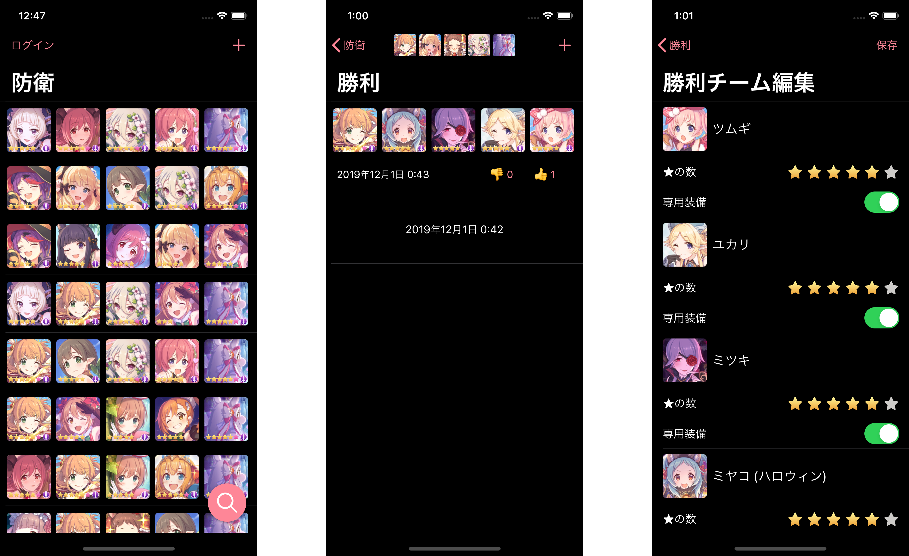

# PriconneDB

プリンセスコネクトのアリーナ編成共有アプリ

## 概要

プリンセスコネクトRe:Dive 内のゲーム内コンテンツである
バトルアリーナをもっと楽に毎日楽しくするのための編成記録管理アプリです

## スクショ



## 技術的な話

検索処理のためデータは Firebase Cloud Firestore を使用しクラウドのDBで管理します、アプリに同期後に In Memory で動作させている Realm にインポートさせています。

作成・更新時に Realm を更新し Firebae Firestore にも反映されます。

Realm 周りのコードは荒いです、メタデータ投入周りも改善したい、あとで直すかも。

## 利用方法

1. Xcode 11 インストール

2. ライブラリのインストール
   
   ```
   $ pod install
   ```

3. `GoogleService-Info.plist`を自前の環境に置き換え

4. ビルド & 実行


